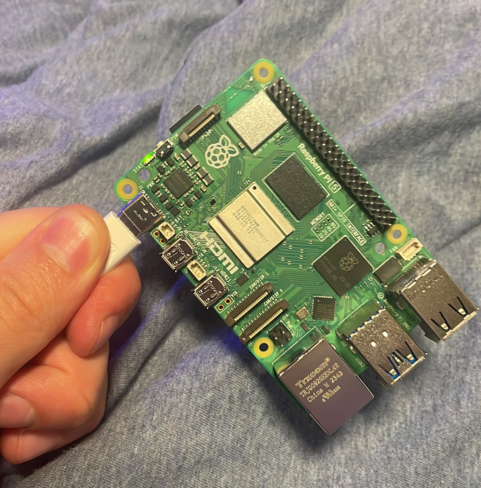
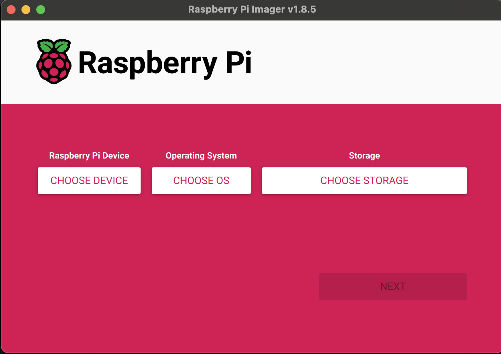
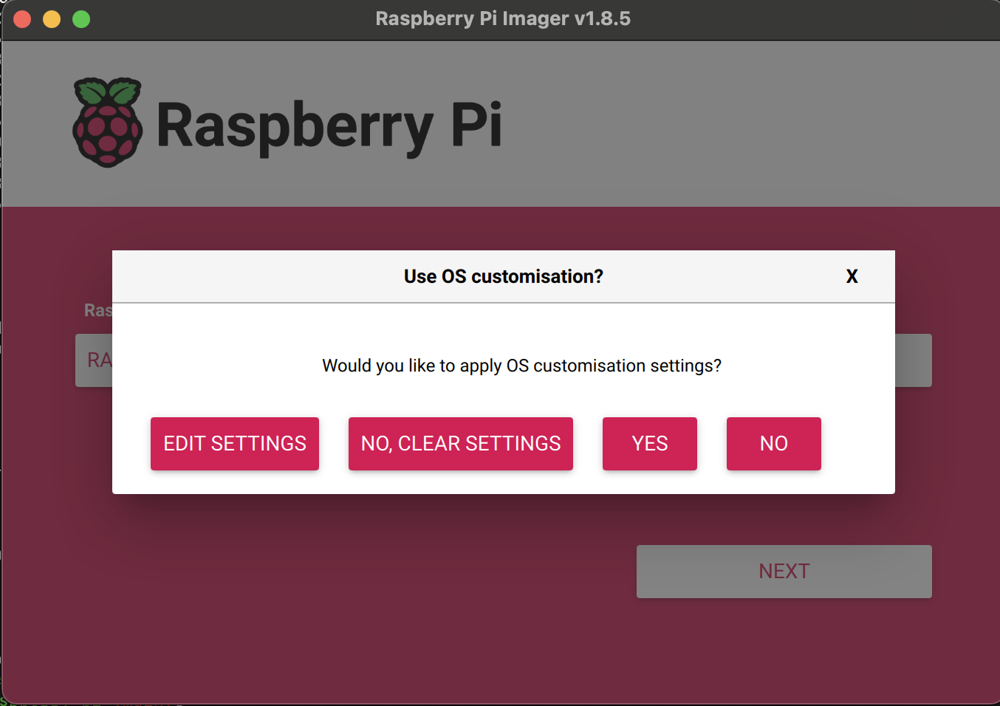
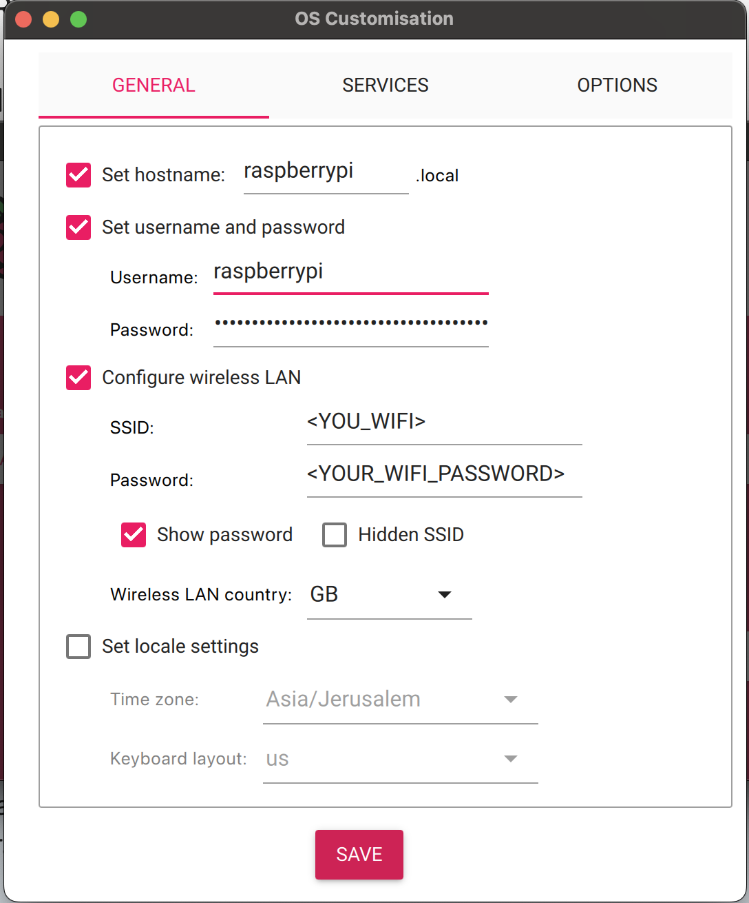

<div align="center">

# How to run LLM (mistral 7b) on Raspberry Pi 5

  

Step-by-Step Guide on how to run Large Language Model on a Raspberry Pi 5 (might work on 4 too, haven't tested it yet)

</div>

### Table of Content:

1. [Prerequisite](#prerequisite)
2. [Setup Raspberry Pi](#setup-raspberry-pi-headless-setup)
3. [Option 1: Run LLMs using Ollama](#option-1-run-llms-using-ollama)
4. [Option 2: Run LLMs using Llama.cpp](#option-2-run-llms-using-llamacpp)
5. [Extra Resoucres](#extra-resoucres)

---

### Prerequisite

- [Raspberry Pi 5, 8GB RAM](https://www.raspberrypi.com/products/raspberry-pi-5/)
- 32GB SD Card

### Setup Raspberry Pi (Headless-setup)

You can also follow along this [YouTube video](https://www.youtube.com/watch?v=9fEnvDgxwbI) instead.

1. Connect the SD card to your laptop
2. Download Raspberry Pi OS (bootloader): [https://www.raspberrypi.com/software/](https://www.raspberrypi.com/software/)
3. Run it, and you should see:
   
   - "Choose Device" - choose Raspberry Pi 5
   - OS, choose the latest (64bit is the recommended)
   - "Choose Storage" - choose the inserted SD card
4. Now click next, and it will ask you if you want to edit the settings, click "Edit settings"
   
5. Configure
   
   - enable hostname and set it to `raspberrypi`.local
   - Set username and password you will remember, we will use them shortly
   - Enable "Configure Wireless LAN" and add your wifi name and password
   - Click save, and contiue. it will take a few minutes to write everything to the SD
6. Insert the SD card to your raspberry pi, and connect it to the electricity
7. SSH into the Raspberry PI:

```bash
ssh ssh <YOUR_USERNAME>@raspberrypi.local
```

### Option 1: Run LLMs using Ollama

1. Install Ollama:

```bash
curl -fsSL https://ollama.com/install.sh | sh
```

2. Download & Run Mistral model:

```bash
ollama run mistral
```

That is it!

### Option 2: Run LLMs using llama.cpp:

1. Install:

```bash
sudo apt update && sudo apt install git g++ wget build-essential
```

2. Download llama.cpp repo:

```bash
git clone https://github.com/ggerganov/llama.cpp
cd llama.cpp
```

3. Compile:

```bash
make -j
```

4. Download Mistral model:

```bash
cd models
wget https://huggingface.co/TheBloke/Mistral-7B-v0.1-GGUF/resolve/main/mistral-7b-v0.1.Q4_K_S.gguf)
```

5. Go back to repo root folder, and run:

```bash
cd ..
./main -m models/mistral-7b-v0.1.Q4_K_S.gguf -p "Whatsup?" -n 400 -e
```

That is it!

### Extra Resoucres:

- [Youtube video on how to run Ollama on Raspberry Pi](https://www.youtube.com/watch?v=ewXANEIC8pY)
- [Llama.cpp own example](https://github.com/garyexplains/examples/blob/master/how-to-run-llama-cpp-on-raspberry-pi.md)
- [Youtube video on how to setup Raspberry PI headlessly](https://www.youtube.com/watch?v=9fEnvDgxwbI)
- [Adam on Twitter](https://twitter.com/adamcohenhillel)
